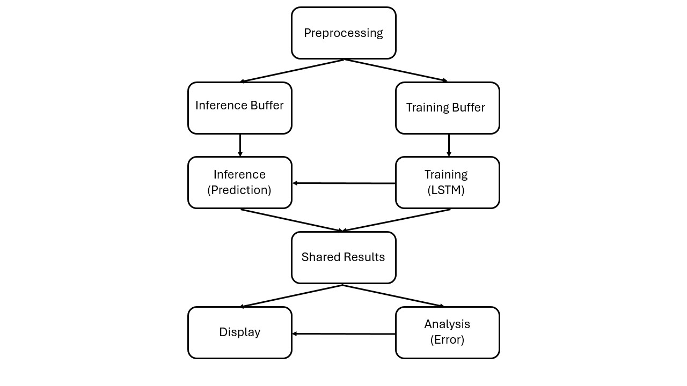
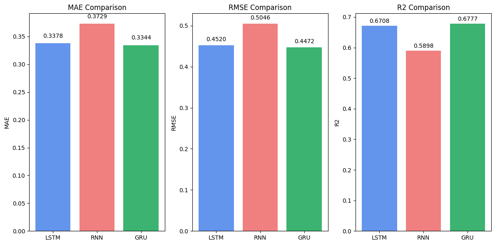
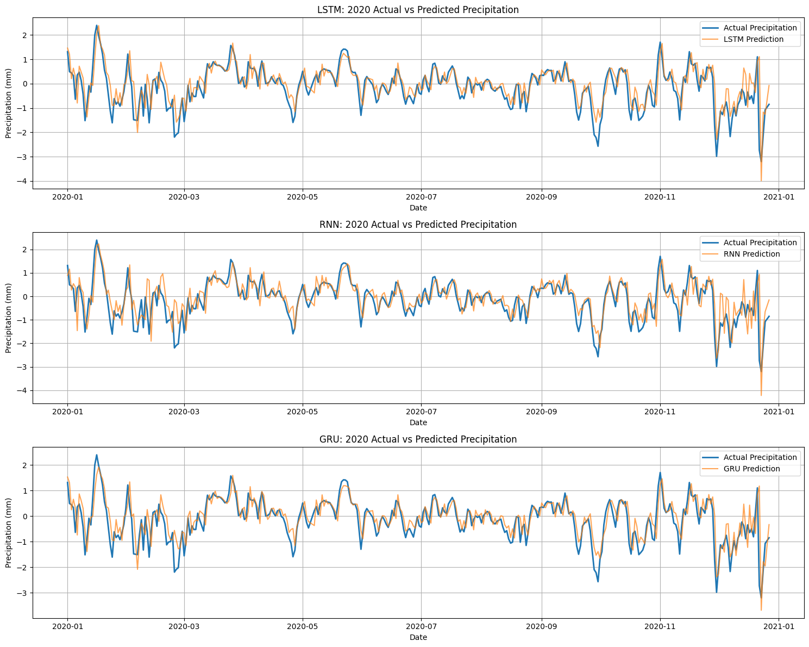
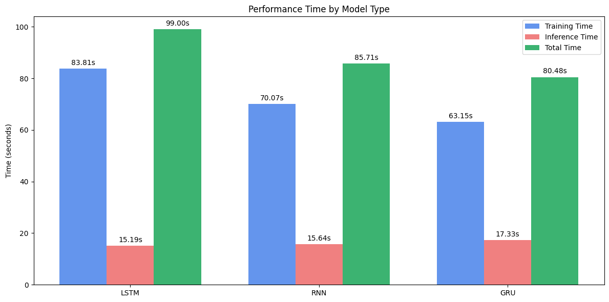
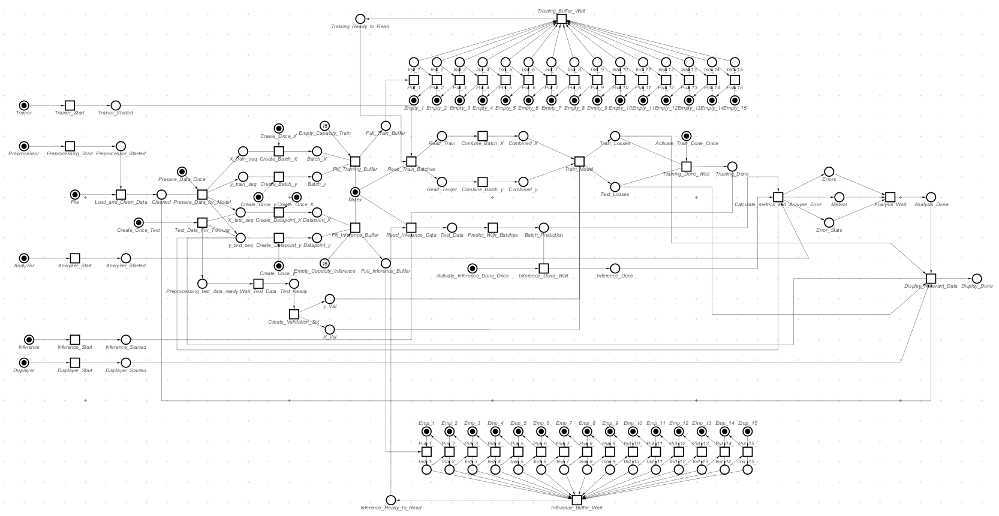

# Weather Forecasting with Concurrent Deep Learning Pipelines  
**Predicting Precipitation & Temperature using LSTM, GRU, RNN**  
**+ Threaded Execution, Mutex Locks, Semaphores, Conditional Variables**

---

## Project Intuition

This project compares the performance of three deep learning models — LSTM, GRU, and RNN — for forecasting weather parameters. What makes this unique is the **concurrent execution design** using **threading, semaphores, mutex locks**, and **Petri net-based process modeling**.

Think of it as creating a small intelligent system where models are not just trained and evaluated but **work simultaneously, safely**, and **efficiently**, just like people in a well-managed office.

---

## Project Files

| Notebook | Purpose |
|----------|---------|
| `Precipitation_Prediction_Basic.ipynb` | Train & predict precipitation sequentially |
| `Precipitation_Prediction_Concurrent.ipynb` | Train & predict concurrently using threads |
| `Temperature_Prediction_Basic.ipynb` | Temperature forecast with basic model runs |
| `Temperature_Prediction_Concurrent.ipynb` | Concurrent temperature prediction |
| `Comparison_of_Models.ipynb` | Compare MAE, RMSE, R², and training/inference times |

---

## Architecture Diagram

This system models:
- **Forking (Concurrency)**: One preprocessing stage sends data to both training and inference.
- **Joining (Synchronization)**: Results from both streams are merged into shared memory.
- **Mutex (Safety)**: Locks are used to prevent two threads from accessing shared resources at once.
- **Conditional Variables**: Avoid deadlocks by ensuring signals are only sent when the receiver is ready.
- **Semaphores**: Model a queue-like structure to manage thread entry, like a petrol station.

---

## Model Comparison

### Evaluation Metrics

Here’s how the models performed:

- **GRU** had the **lowest MAE (0.334)** and **lowest RMSE (0.447)**, and **highest R² (0.678)** — making it the best performer overall.
- **LSTM** came close with **MAE (0.338)**, **RMSE (0.452)**, and **R² (0.671)** — a strong performance, but slightly more time-consuming.
- **RNN** showed the **worst accuracy** with the highest MAE and RMSE, and lowest R², indicating more deviation and less fit.

---

### Prediction Graphs (Actual vs Predicted)

Each subplot shows how well each model predicted the precipitation data over time. GRU and LSTM show closer alignment to the actual values than RNN.
---

### Model Time Comparison

- **GRU:** **Fastest** overall in both training and inference (Total time: **80.48s**).
- **RNN:** **Moderate** in speed (Total time: **85.71s**) but **poorest performance**.
- **LSTM:** **Slowest** in speed (**99s**) due to higher training time, but **strong accuracy**.

---

## Threading & Concurrency – Explained Like a Human

- **Process**: The whole program running (like your office building).
- **Thread**: A worker inside the office. Multiple workers (threads) can run tasks.
- **Mutex**: A locked room — only one person (thread) can enter at a time.
- **Semaphore**: A petrol station queue — you line up instead of coming back tomorrow.
- **Conditional Variable**: You wait for someone to signal you before you move (to avoid deadlocks).
- **Detached Join**: You don’t block the whole system by waiting — instead, you detach and wait until the work finishes naturally.

> Without **mutex**, both training and inference could modify or read the same shared results leading to unpredictable bugs, race conditions, or inconsistent analysis. That’s why mutexes and fairness (via `sleep()`) are critical.

---

## Petri Net Mapping

| Petri Net Concept   | Our Pipeline Equivalent                                |
|---------------------|--------------------------------------------------------|
| **Forking**         | Preprocessing sends to both inference & training       |
| **Joining**         | Shared results are updated only when both finish       |
| **Choice**          | Threads compete for the mutex lock (fairness ensured) |
| **Controlled Choice** | Conditional variables control signal/wait properly    |
| **Arbitration**     | Managed with `wait()` → `signal()` causality           |
| **Merging**         | Shared buffer combines model predictions and errors    |

---

## Safety & Fairness

To prevent cache starvation and race conditions:
- `sleep()` ensures no single thread hogs CPU time (ensures fairness).
- Proper memory deallocation and cleanup avoids memory leaks.
- Conditional variables ensure **causality**: inference doesn’t wait on a signal that never comes.

---

## Conclusion

This project isn't just about ML models; it's about simulating **real-world concurrent systems**. We’ve built a system where each model independently processes data, respects shared resources, and contributes to a central analysis — all while maintaining safety, fairness, and performance.
